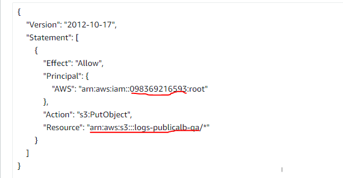
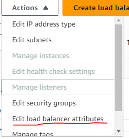
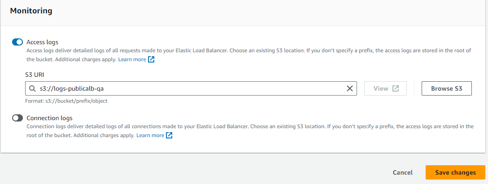
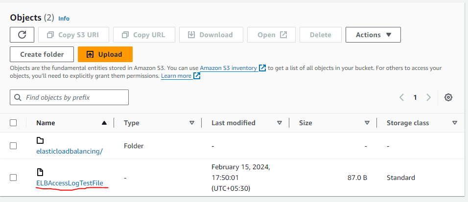

<h2>Create s3 bucket where you want to store logs of ALB</h2>
create s3 bucket and attach this permission to the bucket.

 

Number is your region id this is for a south Aferica you can search for your region
arn:aws:s3:::logs-publicalb-qa this is you bucket arn

Step 2:
Select the alb which you can to store the logs in s3 and click on edit load balancer attributes.

 

Scroll to bottom and enable the Access logs.
And click on Browse s3 and select the bucket which we created and attached permission to it and save it.

 

After 5-10 later open the s3 bucket which we attached to ALB
Then you can find a folder AWSLogs->Your_accountID(232424234)->ELBAccessLogTestFile

If inside the account id you find ELBAccessLogTestFile then you have configured the alb logs to s3 successfully.

 

------------------------------------------
Offical link
https://docs.aws.amazon.com/elasticloadbalancing/latest/application/enable-access-logging.html
