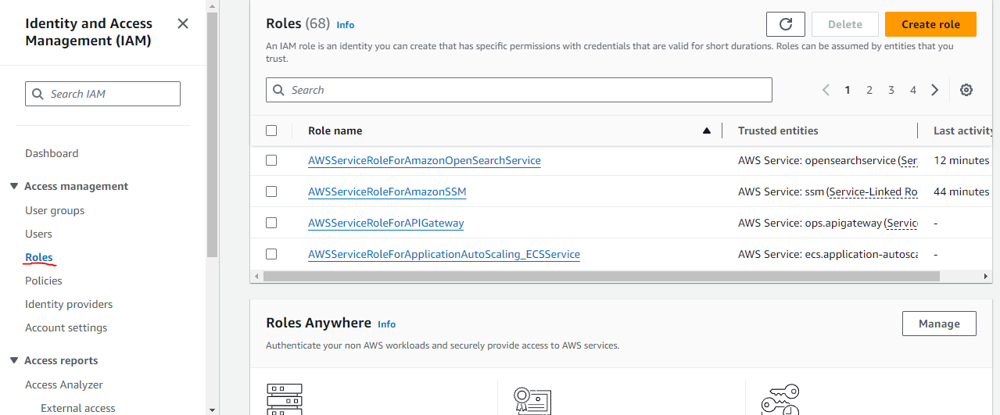

step 1: Open SSM service Select Parameter Store and Create parameter
 

<h2>Create Parameter</h2>
Give any name to your parameter then follow the step in the SS
 

In value field past the below json.

{
    "metrics": {
        "append_dimensions": {
            "InstanceId": "${aws:InstanceId}"
        },
        "metrics_collected": {
            "mem": {
                "measurement": [
                    "mem_used_percent"
                ],
                "metrics_collection_interval": 60
            },
            "disk": {
                "measurement": [
                    "used_percent"
                ],
                "metrics_collection_interval": 60,
                "resources": ["*"]
            }
        }
    }
}

<h2>Create IAM Role</h2>
Create role
 

Select AWS service
 

Select EC2
 

Search AmazonSSMFullAccess and CloudwatchFullAccess select the checkbox
 

Role details
 

Create Role
 

<h2>Attach role to the instance which you want to monitor disk and memory</h2>
 

Select the role name which we recently created and update
 

<h2>SSH the instance</h2>
Commands:

sudo apt update

cd /opt/ && sudo mkdir cloudWatchAgent && cd cloudWatchAgent

sudo wget https://amazoncloudwatch-agent.s3.amazonaws.com/ubuntu/amd64/latest/amazon-cloudwatch-agent.deb

sudo dpkg -i -E ./amazon-cloudwatch-agent.deb

sudo /opt/aws/amazon-cloudwatch-agent/bin/amazon-cloudwatch-agent-ctl -a fetch-config -m ec2 -c ssm:/alarm/AWS-CWAgentLinConfig -s

sudo /opt/aws/amazon-cloudwatch-agent/bin/amazon-cloudwatch-agent-ctl -m ec2 -a status

 
 

<h2>Open Cloudwatch and select Alarm and Create Alarm</h2>
Select CWagent
 

In InstanceId, device, fstype, path you can find disk monitoring path
And in InstanceId you can find memory monitoring
 

