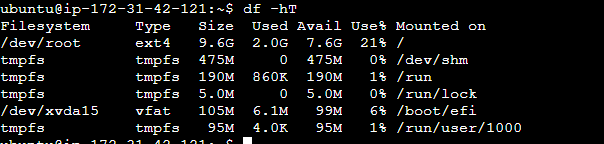

Step 1: Open ec2 service and select the volume id you want to increase click on Action and then Modify volumes.
 

Step 2: Increase the size and modify you can see Size is updated.
<b>

<b>

Step 3: Check the EBS Volume is updated
<h3>command: lsblk</h3>

 

Step 4: Determine instance is type of Xen or Nitro <h2>(Note that device and partition naming differs for Xen instances and instances built on the Nitro System) if yours instance is type of Nitro then follow the official link</h2>
<h3>command: aws ec2 describe-instance-types --instance-type instance_type --query "InstanceTypes[].Hypervisor"</h3>

 

Step 5: Increase the partition
<h3>command: sudo growpart /dev/xvda 1</h3>
In above command 1 determine the partition number on which partition size to be grow

 

Step 6: confirm the partition is successfully grow.
<h3>command: sudo lsblk</h3> 

 
 you can see the partition is grow from 8GB to 10GB

Step 7: Now resize the Filesystem
 
 
 

 

-----------------------------------------------------------------------

Official Links
https://docs.aws.amazon.com/ebs/latest/userguide/recognize-expanded-volume-linux.html