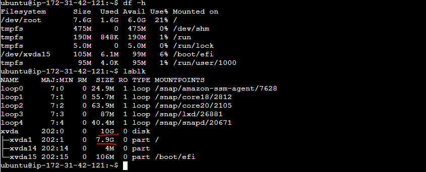
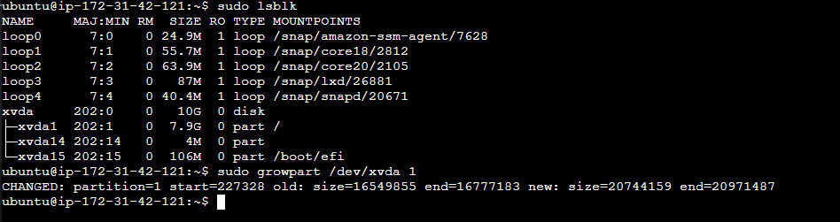
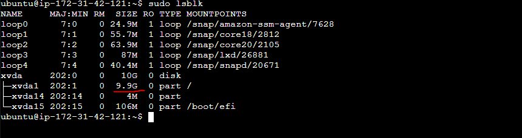
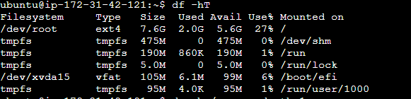
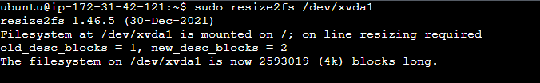

<h2>Open Volumes from EC2 service</h2>

 

<h2>Click on create volume</h2>

 

<h2>Make sure that you create the volume in same Availability Zone in which your EC2 instance exist</h2>

 
 

<h2>Select the volume once it's status Available after you created and click on Action and select attach</h2>

 

<h2>Select the instance to which you want to attach this volume and device name and Attach volume</h2>

 

<h2>Select you EC2 instance to which you attached the volume under storage option you can find the second volume which we attached</h2>

 

<h2>Make directory to attach your volume</h2>

 

command: lsblk
you will see new disk.

<h2>Create filesystem for your disk</h2>
command: sudo mkfs -t ext4 /dev/diskname (from previsious command lsblk)

 

confirm it's created
sudo file -s /dev/diskname

 

<h2>mount your disk to directory which we created previously</h2>

 

<h1>Auto Attach volume to directory after system restart (When you restart your system in future your attached volume get detached so it get reattched if the system get restarted)</h1>

Get the uuid of your disk and copy it

command: sudo lsblk -o +UUID

 

<h2>Open fstab and past the uuid so disk can reattach </h2>
command: sudo /etc/fstab

 

<h2>To confirm that volume can reattach</h2>
unmount the volume from the directory
command: sudo umount /mtn/elk_data(directory name to which you attached the volume)

df -h (now the disk is gone)

so to automount disk to /mtn/elk_data

command sudo mount -a (this will check fstab file and attach all the disk to their respective directory)

 
